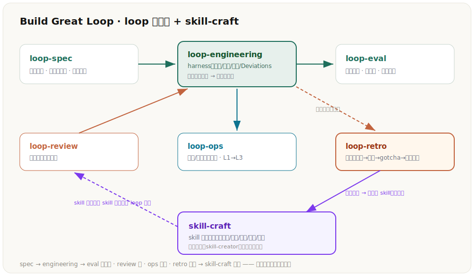
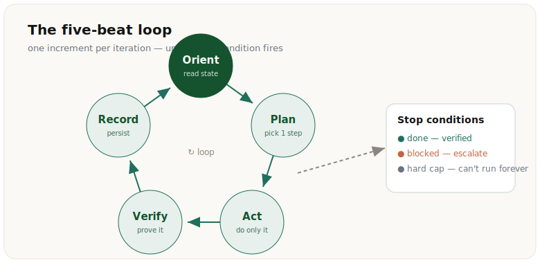

# Build Great Loop · Loop Engineering Skills

[中文](README.md) | [English](README.en.md)


一个**可组合的「循环工程（Loop Engineering）」技能组**，同时支持 Codex 和 Claude Code。
当你需要让 AI **自己跑、跑到完成、中途被打断也能续上、还不假装做完**时，触发它——它会
访谈你的任务，然后产出一份**可直接粘贴的顶级循环提示词（harness）**。

> 模型是发动机，循环是发动机外面的整个底盘：它要朝目标走的方向、它记得住的状态、让它
> 诚实的验证、以及告诉它何时该停的规矩。这套技能把「老手才会下意识做的事」变成提示词里
> 的默认动作。



---

## 这是什么

`Build Great Loop` 不是一个单体技能，而是 **4 个各司其职、可独立触发、也能串起来用**的技能：

| 技能 | 作用 | 什么时候触发 |
|---|---|---|
| **loop-spec** | 访谈式把模糊任务变成一份可执行的 `SPEC.md` | 任务还没想清、需要先定目标/成功标准/停止条件 |
| **loop-engineering**（核心） | 访谈 → 产出**可粘贴的循环提示词本体** | 「帮我写个能一直跑到完成的 agent / 循环 / harness」 |
| **loop-eval** | 设计成功标准 + 小评测集 + 评分器（pass@k vs pass^k） | 「怎么知道这循环靠不靠谱 / 给 agent 写评测」 |
| **loop-review** | 体检并加固一份**已有**的循环提示词 | 「我的 agent 老是停不下来 / 说完成了其实没有 / 重启丢进度」 |

设计与最佳实践来自 Anthropic、GitHub、Sourcegraph、OpenAI 的官方工程文章（见[来源](#来源与致谢)）。

---

## 适用场景

- 自主编码 / build-until-green：逐个实现接口或功能，直到测试全过。
- 批量处理：通宵给上千条数据打标 / 清洗 / 翻译，可中断续跑。
- 自主研究：查权威资料、挖到有把握、带来源出报告。
- 调试循环：复现 → 假设 → 验证 → 修复，直到锁定根因。
- 数据迁移等「跑数小时、必被打断、绝不能重复或漏」的长任务。
- 以及——**给一份已有的循环提示词做体检**，告诉你它会在哪翻车、怎么修。

---

## 安装

### 最简单方式：让 AI Agent 按 URL 安装

直接对你的 Codex / Claude Code 说：

> 帮我安装这个 skill 组：`https://github.com/VioletScar-Hui/Build_Great_Loop`
> 把仓库里的 `loop-spec` / `loop-engineering` / `loop-eval` / `loop-review` 四个目录，
> 复制到我的 skills 目录下。

### Codex（Windows PowerShell）

```powershell
$tmp = Join-Path $env:TEMP "build_great_loop"
git clone --depth 1 https://github.com/VioletScar-Hui/Build_Great_Loop $tmp
$dest = "$env:USERPROFILE\.codex\skills"
New-Item -ItemType Directory -Force $dest | Out-Null
"loop-spec","loop-engineering","loop-eval","loop-review" | ForEach-Object {
  Copy-Item -Recurse -Force "$tmp\$_" $dest
}
Remove-Item -Recurse -Force $tmp
```

### Claude Code（Windows PowerShell）

```powershell
$tmp = Join-Path $env:TEMP "build_great_loop"
git clone --depth 1 https://github.com/VioletScar-Hui/Build_Great_Loop $tmp
$dest = "$env:USERPROFILE\.claude\skills"
New-Item -ItemType Directory -Force $dest | Out-Null
"loop-spec","loop-engineering","loop-eval","loop-review" | ForEach-Object {
  Copy-Item -Recurse -Force "$tmp\$_" $dest
}
Remove-Item -Recurse -Force $tmp
```

### macOS / Linux（bash）

```bash
tmp=$(mktemp -d)
git clone --depth 1 https://github.com/VioletScar-Hui/Build_Great_Loop "$tmp"
dest="$HOME/.claude/skills"          # Codex 改成 "$HOME/.codex/skills"
mkdir -p "$dest"
for s in loop-spec loop-engineering loop-eval loop-review; do cp -R "$tmp/$s" "$dest/"; done
rm -rf "$tmp"
```

### 给 AI Agent 的快速安装检查

```powershell
"loop-spec","loop-engineering","loop-eval","loop-review" | ForEach-Object {
  $p = "$env:USERPROFILE\.claude\skills\$_\SKILL.md"   # Codex 改 .codex
  if (Test-Path $p) { "OK  $_" } else { "MISSING  $_" }
}
```

四行都是 `OK` 即安装成功。

---

## 第一次成功运行

装好后，新开一个会话，直接用自然语言描述一个**需要反复跑**的任务，例如：

> 帮我写一个能可靠运行的循环：把 `notes/` 下每个 `.md` 生成一句话摘要、写进
> `summaries.csv`，要能中断后续跑、不重复、不漏。

`loop-engineering` 会被触发，先问你一两个关键问题（目标怎么算完成、什么时候该停），
然后产出一份**可直接粘贴**的循环提示词——含成功标准、停止条件（带硬上限）、五拍循环、
外置状态、崩溃安全续跑、验证与护栏、以及一行能让你一眼看健康度的状态。

---

## 工作流

四个技能可以单独用，也可以串起来：

```
loop-spec  ──►  loop-engineering  ──►  loop-eval
(定目标)        (产出循环提示词)        (设计验证/评测)
                      ▲
                      │
                 loop-review  （拿已有提示词来体检、加固）
```

---

## 核心方法



- **五拍循环**：`Orient`（先读状态）→ `Plan`（选一个最小增量）→ `Act`（只做这一个）→
  `Verify`（像用户那样真验）→ `Record`（写进耐久状态，保持干净可交接）。
- **七个设计维度**：目标与可验证的成功标准、停止条件、循环骨架、状态与记忆、上下文纪律、
  工具、验证与护栏。
- **两大失败模式**：贪多冒进（一口气做完→上下文爆）与虚假完成（没测就说做完）——每份产出
  都要点名防御这两个。
- **四条「操作级严谨度」**（把「合格」抬到「顶级」）：成功标准机器可检、崩溃安全 + 幂等续跑、
  按任务规模设上限、给运维者一行可一眼扫到的状态。

详见 `loop-engineering/references/`（`principles` / `patterns` / `harness-template` /
`context-and-state` / `checklist`）。

---

## 为什么相信它

不是凭感觉——用 with-skill vs baseline 的对照评测验证过：

| 轮次 | 对比 | 结果 |
|---|---|---|
| 第一轮 | 带技能 vs 裸跑（4 个任务，8 条结构性断言） | **100% vs 69%** |
| 第二轮 | v2 vs v1（5 个任务，更高的质量断言） | **100% vs 70%（+30 分）** |

第二轮发现：提升精准集中在**硬上限设定、崩溃安全、可运维状态**——这些恰是基线在「隐含
要求」下最常漏掉的。代价仅约 +18 秒 / +2k token。

---

## 版本亮点

| 版本 | 要点 |
|---|---|
| v1 | 初版：五拍循环 + 七维度 + 两大失败模式；4 技能组合；6 篇参考资料蒸馏 |
| v2 | 操作级严谨度：机器可检标准、崩溃安全幂等续跑、按规模设上限、可一眼扫到的状态（评测 v2 100% vs v1 70%） |
| v2.1 | 参照「工作流 Skill 最佳实践」加固：`Rationalizations` 反驳表（堵住作者偷懒）+ Weak-vs-strong 对比教学 |

---

## 仓库结构

```
Build_Great_Loop/
├── README.md / README.en.md
├── LICENSE
├── loop-engineering/        # 核心：产出循环提示词
│   ├── SKILL.md
│   ├── references/          # principles / patterns / harness-template / context-and-state / checklist
│   ├── assets/              # harness-skeleton.md（空白模板）
│   └── evals/evals.json     # 示例评测集
├── loop-spec/               # 访谈 → SPEC.md（assets/spec-template.md）
├── loop-eval/               # 成功标准 + 评测（assets/eval-template.md）
└── loop-review/             # 审计/加固已有循环
```

---

## 更新方式

重新跑一遍上面的安装脚本即可（`git clone` 拉最新，覆盖同名目录）。

---

## 常见问题

- **Q：和 Claude Code 自带的 `/loop` 是一回事吗？** 不是。`/loop` 是「按间隔重复跑一条命令」；
  这套技能是**设计循环本身**——目标、状态、验证、停止条件，产出的是提示词/harness。
- **Q：只想用其中一个技能行吗？** 行。四个都能独立触发；不想要的目录不复制即可。
- **Q：产出的提示词是中文还是英文？** 跟随你对话的语言；技能内部说明是英文（触发更稳、对齐源文章）。
- **Q：能在 Cursor / 其他 agent 里用吗？** 技能本质是「知识注入」的 Markdown，任何能读
  `SKILL.md` 的 agent 都能用；安装路径按各家约定调整。

---

## 来源与致谢

方法蒸馏自以下官方工程文章：

- Anthropic — Effective harnesses for long-running agents / Effective context engineering for AI agents /
  Writing effective tools for AI agents / Demystifying evals for AI agents
- GitHub — Spec-driven development / Agentic primitives & context engineering / Continuous AI（agentic CI）
- Sourcegraph — Agentic Coding in 2026
- OpenAI — Codex best practices
- 技能写作模式参考：青斧《工作流的 Skill 怎么写？从 7 个顶级 Skill 中提炼的模式与最佳实践》

---

## License

MIT，见 [LICENSE](LICENSE)。
